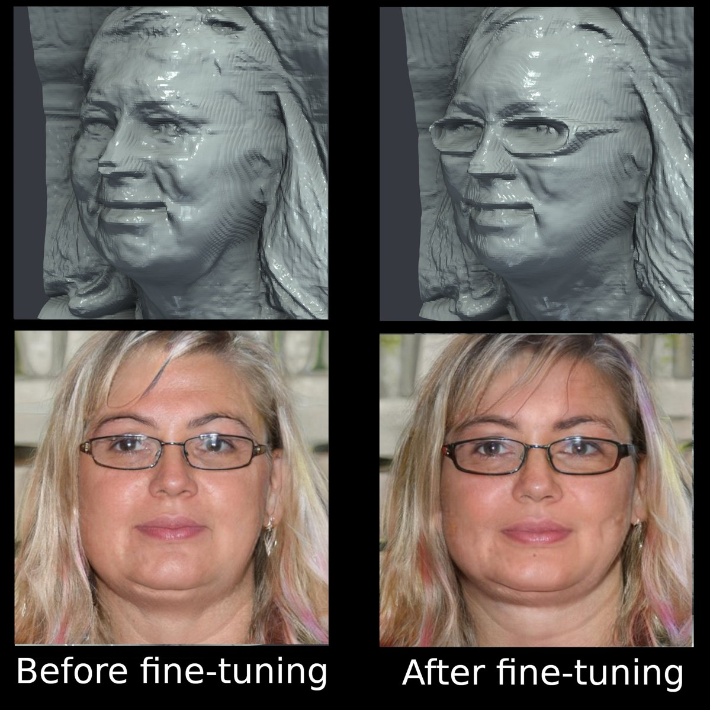

# EG3D RLHF Geometry

Improving the 3D geometry of [EG3D](https://github.com/NVlabs/eg3d), a 3D-aware GAN, using human preference supervision.

Paper: arXiv link coming soon.

## Overview

EG3D produces strong rendered views, but the underlying geometry often contains unrealistic surface distortions and implausible shapes that are easy to miss in the 2D images. These defects are usually obvious to a human looking at the extracted mesh. The approach here is to learn a geometry-sensitive reward model from quality rankings of samples drawn from the pretrained generator, and then fine-tune EG3D against that reward model. In spirit this is similar to RLHF, though it is not reinforcement learning per se — the reward enters as a differentiable regulariser on the generator update rather than through a policy-gradient method such as PPO.

The work proceeded in three stages:

1. Sample geometry from a pretrained EG3D generator and collect human rankings over shape quality;
2. Train a reward model on a geometry-derived representation of those rankings;
3. Fine-tune EG3D so the generator produces geometry that scores better under the learned reward.

Most of the effort went into comparing 3D representations for both the reward model and the fine-tuning loop. Reward models that operate in the 2D domain or on a 2D-derived 3D representation (for example a point cloud lifted from a depth map) are sometimes accurate as standalone rankers, but unstable when used to drive fine-tuning. The representation that worked in both settings is a cropped 3D sigma-density field sampled directly from the radiance field, at resolution 256.

## Result

Geometry from the fine-tuned generator was preferred by human raters in 74% of pairwise comparisons against the original EG3D, while the RGB renders remain consistent with the original. Identity is preserved for fixed latent codes. An example is shown below: before fine-tuning (left) and after (right), with the extracted mesh on top and the RGB render underneath. The released fine-tuned checkpoint is the model used to synthesise the geometry reported in the paper.




## Tech stack

- EG3D fork (PyTorch) for generation and the fine-tuning loop.
- Reward-model training framework built on Hydra and PyTorch Lightning. A shared model base is used across representations: a representation-specific backbone produces global features, and shallow MLP heads decode them into preference logits over paired samples.
- End-to-end runnable on a single RTX 4090.

## What is released

This repository contains the code for:

- Extracting the 3D representations from EG3D;
- Training reward models over those representations (experiment configs, run with Hydra);
- Fine-tuning EG3D against a trained reward model (experiment configs, run with Hydra);
- The post-hoc analysis and mesh-export scripts used for the paper figures.

The ranked dataset metadata used to build the reward-model training data is included. Two checkpoints are distributed as GitHub Release assets:

- The sigma-field reward model (`reward-model-7wnzkgie-sfield256.zip`);
- The fine-tuned EG3D generator (`eg3d-finetuned-sfield-run01446-network-snapshot-002068_LAST.pkl`).

Reward-model training can be reproduced from the released code and data. Full EG3D fine-tuning cannot be reproduced as-is: it requires the original FFHQ images, which are not redistributed here and, as far as I know, are not available online — they must be re-synthesised from scratch following the [original EG3D repository](https://github.com/NVlabs/eg3d). The baseline EG3D checkpoint (`ffhq512-128.pkl`) is also external and comes from there.

## Repository layout

| Path | Contents |
|---|---|
| `eg3d/` | EG3D fork plus the RLHF fine-tuning loop (`train_rlhf.py`) and the mesh-export / analysis scripts |
| `reward_model_training/` | Hydra + Lightning reward-model framework, the data-generation scripts, and the ranked-preference metadata |
| `dataset_preprocessing/` | EG3D dataset preprocessing (inherited from upstream) |
| `external/` | bundled third-party components (e.g. the dlib landmark model, point-cloud backbones) |
| `paper_artifacts/`, `paper_result_analyses/` | optional post-hoc analyses behind the paper figures (UMAP, SHAP, cross-generator transfer) |
| `docs/` | documentation (see below) |

## Documentation

| Doc | Topic |
|---|---|
| [docs/data_generation.md](docs/data_generation.md) | rebuild the reward-model training inputs from an EG3D checkpoint |
| [docs/reward_models.md](docs/reward_models.md) | train reward models; the representation/backbone experiment configs |
| [docs/finetuning.md](docs/finetuning.md) | fine-tune EG3D from any reward model; the reported run and smoke runs |
| [docs/reproducing_paper.md](docs/reproducing_paper.md) | map of paper results to scripts/configs, plus verification commands |
| [docs/released_artifacts.md](docs/released_artifacts.md) | the released checkpoints and their loading contract |
| [docs/camera_conventions.md](docs/camera_conventions.md) | camera pose / intrinsics conventions used throughout |

## Setup

Tested with Python 3.9, CUDA 11.8, PyTorch 2.0.1. The full environment:

```sh
git clone https://github.com/apmoore499/eg3d-rlhf-geometry
cd eg3d-rlhf-geometry
conda config --add channels conda-forge
conda create -n hf_geom_eg3d_py39 python=3.9 -y
conda activate hf_geom_eg3d_py39
conda install -y -c pytorch -c nvidia pytorch=2.0.1 torchvision torchaudio pytorch-cuda=11.8
python -m pip install uv
python -m uv pip install fvcore iopath
python -m pip install --no-index --no-cache-dir pytorch3d -f https://dl.fbaipublicfiles.com/pytorch3d/packaging/wheels/py39_cu118_pyt201/pytorch3d-0.7.4-cp39-cp39-linux_x86_64.whl
python -m uv pip install -r requirements.txt
```

`external/dlib/shape_predictor_5_face_landmarks.dat` is tracked in the repo and used by the landmark path. A few optional analysis scripts also expect [PyGeM](https://github.com/mathLab/PyGeM).

## Download the released models

```sh
gh release download --repo apmoore499/eg3d-rlhf-geometry --pattern 'reward-model-7wnzkgie-sfield256.zip' --dir external_assets
gh release download --repo apmoore499/eg3d-rlhf-geometry --pattern 'eg3d-finetuned-sfield-run01446-network-snapshot-002068_LAST.pkl' --dir external_assets
```

The reward model loads from a bundle directory holding both `best_model.pt` and `release_config.yaml`, so the tune-time data transforms stay coupled to the weights rather than being redeclared at inference time. The loader looks for that bundle under `RWD_MODELS_FOR_TUNING/<id>/`, so unzip it there:

```sh
unzip external_assets/reward-model-7wnzkgie-sfield256.zip -d reward_model_training/reward_model_framework/core_modules/RWD_MODELS_FOR_TUNING/
```

This gives `RWD_MODELS_FOR_TUNING/7wnzkgie/{best_model.pt,release_config.yaml}`, which the loader picks up with no further configuration. The fine-tuned generator `.pkl` needs no special placement — it is passed directly to the analysis scripts (see below).

## Running the experiments

Reward-model training is launched through Hydra by selecting an `experiment`. Train the reported sigma-field reward model:

```sh
cd reward_model_training/reward_model_framework
python -m core_modules.train_rwd_model experiment=sfield_256
```

Other reward-model configs: `sdmap` (single depth map), `tdmap` (triple depth map), and `pcd_pnet_point_cloud_entire`, `pcd_pnet2_point_cloud_entire`, `pcd_cvnet_point_cloud_entire` (full point cloud with PointNet, PointNet++, and [CurveNet](https://github.com/tiangexiang/CurveNet) backbones).

Run the reported sigma-field fine-tuning:

```sh
cd eg3d
bash reward_tune_analysis/scripts/sfield_reported_run.sh
```

Fine-tuning configs: `finetune_eg3d_sfield`, `finetune_eg3d_sdmap`, `finetune_eg3d_tdmap`, `finetune_eg3d_pn1`, and `finetune_eg3d_null` (baseline).

Export the before/after mesh comparison (tuned vs. original) used for the paper figures:

```sh
cd eg3d
python reward_tune_analysis/scripts/export_snapshot_mesh_bank.py --baseline-pkl /path/to/ffhq512-128.pkl --tuned-pkl /path/to/network-snapshot-002068_LAST.pkl
```

## License

Non-commercial research use, under the NVIDIA Source Code License for EG3D — see
[`LICENSE.txt`](LICENSE.txt). Bundled third-party components are credited in
[`THIRD_PARTY_NOTICES.md`](THIRD_PARTY_NOTICES.md).

## Citation

If you use this code or the released models, please cite the paper (arXiv link
coming soon):

```bibtex
@misc{moore2026eg3drlhf,
  title         = {Using Human Feedback to Fine-Tune Implicit 3D Face Geometry},
  author        = {Moore, Archer P. and Gong, Mingming and Hodgkinson, Liam},
  year          = {2026},
  eprint        = {2026.XXXXX},   % fill in once the arXiv preprint is posted
  archivePrefix = {arXiv},
  primaryClass  = {cs.CV}
}
```

## Contact

Archer Moore — archerplmoore@gmail.com · [@apmoore499](https://github.com/apmoore499)
